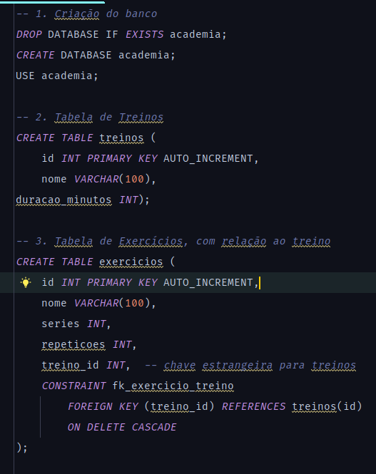
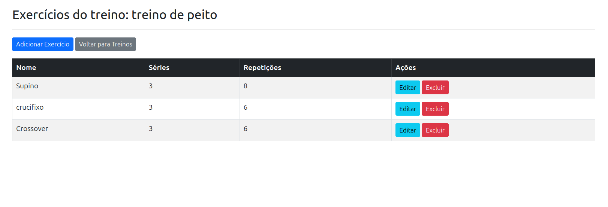
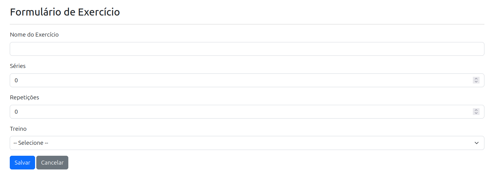

# Sistema de Academia - Gerenciamento de Treinos e Exercicios
Este é um sistema web de gerenciamento de treinos e exercícios, desenvolvido com Spring Boot, Thymeleaf e MySQL. A aplicação permite cadastrar, editar, listar e excluir treinos e seus respectivos exercícios

## 📋 Funcionalidades
Cadastro de Treinos com nome e duração.

- ✅ Cadastro, edição e exclusão de treinos

- ✅ Cadastro, edição e exclusão de exercícios

- ✅ Associação de exercícios a treinos

- ✅ Visualização de todos os treinos e seus respectivos exercícios

- ✅ Relacionamento entre entidades com JPA/Hibernate

# 💻 Tecnologias Utilizadas 
- Java 21
- Spring Boot
- Spring Web
- Spring Data JPA
- Spring Boot DevTools
- Spring HATEOAS
- Lombok
- Thymeleaf (HTML dinâmico)
- MySQL
- Maven

# 🗃 Estrutura do Banco de Dados

# 📸 Imagens do Projeto

# Requisitos 
- Java 17+
- Spring Boot
- Spring Web
- Spring Data JPA
- Spring Boot DevTools
- Spring HATEOAS
- Lombok
- Thymeleaf (HTML dinâmico)
- MySQL
- Maven

# 👨‍💻 Autor

Desenvolvido por [JonataFreitas]

[LinkedIn](https://www.linkedin.com/in/jonatadev) | [GitHub](https://github.com/devJonatas06)

